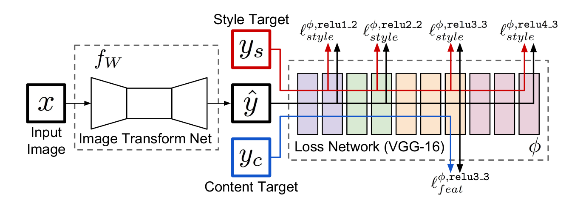

# Artistic Style Transfer App

A cli application which trains the models for style images and stylizes the
content images based on the style model selected. This tool is based on the
paper by
[Perceptual Losses for Real-Time Style Transfer and Super-Resolution](https://arxiv.org/abs/1603.08155)
and [Instance Normalization](https://arxiv.org/pdf/1607.08022.pdf).

## Live demo

Check out the live demo of these models at [bit.ly/stylizeapp](http://bit.ly/stylizeapp)  
GitHub repo for the website: [Stylize App](https://github.com/puneet29/stylizeapp)

## Requirements

The tool is written in Python and uses Pytorch and SciPy. A GPU is not required
but it can significantly speed up the process of training, the styling however
can be done using CPU of a normal laptop or computer as well using the saved
models.

## Model


from [Johnson et al](https://arxiv.org/abs/1603.08155)

Model makes use of a Transformation Network which converts the input image into
output image. We use a loss network pretrained for image classification to
define perceptual loss functions that measure perceptual differences in content
and style between the images. The loss network remains fixed during the training
process.

## Usage

### Stylize Image

```bash
python stylize.py --content-image </path/to/content/image> --model </path/to/saved/model> --output-image </path/to/output/image> --cuda 0
```

- ```--content-image```: path to the content image you want to style.
- ```--model```: saved model for the style to be applied.
- ```--output-image```: path to the output image(with name and extension).
- ```--cuda```: set 1 if you have cuda and a GPU else 0
- ```--content-scale```: factor by which you want to scale down the image(for low memory issues). (Optional, default: None)
- ```--style-strength```: the strength of style to be applied. (Optional, default: 1)

### Train Model

```bash
python train.py --dataset </path/to/train-dataset> --style-image </path/to/style/image> --save-model-dir </path/to/save-model/folder> --epochs 2 --cuda 1
```

- ```--dataset```: path to where the training dataset is stored. (Use [COCO 2014 Training images dataset](http://cocodataset.org/#download)).
- ```--style-image```: path to the style image on which the model is to be trained. (Optional, default:'images/style-images/mosaic.jpg')
- ```--save-model-dir```: path to which the model will be saved after training.
- ```--cuda```: set 1 if you have cuda and a GPU else 0
- ```--epochs```: No. of epochs (Optional, default: 2)
- ```--batch-size```: Batch size used by trainloader (Optional, default: 4)
- ```--checkpoint-model-dir```: path to folder where checkpoints of trained models will be saved. (Optional, default: None)
- ```--image-size```: size of training images. (Optional, default: 256)
- ```--style-size```: size of style-image, default is the original size of style image. (Optional, default: None)
- ```--seed```: random seed for training. (Optional, default: 42)
- ```--content-weight```: weight for content-loss. This may vary for every style. (Optional, default: 1e5)
- ```--style-weight```: weight for style-loss. This may vary for every style. (Optional, default: 1e10)
- ```--lr```: learning rate. (Optional, deafult: 1e3)
- ```--checkpoint-interval```: number of batches after which a checkpoint of the trained model will be created. (Optional, default: 2000)

The hyper-parameters content-weight and style-weight may be altered depending on
the style to be trained on for better results.

### Live webcam stylizing


```bash
python webcam.py --model </path/to/saved/model> --width 640 --height 360 --cuda 1
```

- ```--model```: saved model for the style to be applied.
- ```--width```: width of the image captured by camera, default 640
- ```--height```: height of the image captured by camera, default 360
- ```--cuda```: set 1 if you have cuda and a GPU else 0 (Preferably use a GPU for low latency)
- ```--save```: save captured frame to video, default False
- ```--output```: path to save video, set --save to True, default 'output.avi'
- ```--codec```: codec of output video, default XVID
- ```--fps```: FPS of output video. Adjust according to your system, default 20

Press esc to exit the camera capture window.

## Models

- ### Mosaic

Stored under models as: [mosaic.model](./models/mosaic.model)  
  
Credits for content image: [Aryaman Arya](https://www.instagram.com/aryaman_photography/)
